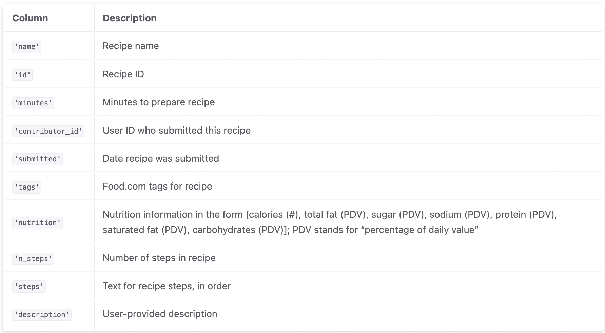
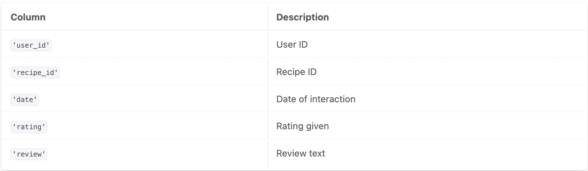

# recipe-calorie-analysis

## Introduction
My analysis seeks to unravel a compelling query: **"Do recipes with a higher number of ingredients typically contain more calories?"** This investigation delves into the intriguing relationship between the complexity of a recipe, in terms of ingredient count, and its caloric content. This question is crucial for readers who are health-conscious, culinary enthusiasts, or anyone interested in understanding the nutritional implications of their food choices. By exploring our dataset, readers can gain insights into how the simplicity or complexity of recipes influences their calorie count, thereby aiding in making more informed dietary decisions. This study not only caters to those tracking their caloric intake but also offers valuable knowledge for culinary professionals and hobbyists who are keen to balance flavor and nutrition.

## Datasets
There are primarily two datasets that have been used in my analysis: `recipes` and `ratings`.
Description of `recipes` dataset:

The `recipes` dataset had **83782 rows** and **12 columns**
Description of 'ratings dataset:

The `recipes` dataset had **731927 rows** and **5 columns**